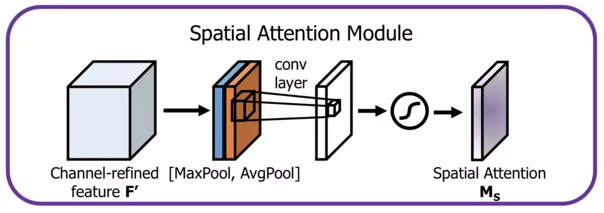

# Attention
## Attention 的 N 种类型
Attention 有很多种不同的类型：Soft Attention、Hard Attention、静态Attention、动态Attention、Self Attention 等等。下面就跟大家解释一下这些不同的 Attention 都有哪些差别。

由于这篇文章[《Attention用于NLP的一些小结》](https://zhuanlan.zhihu.com/p/35739040)已经总结的很好的，下面就直接引用了：
本节从计算区域、所用信息、结构层次和模型等方面对Attention的形式进行归类。
1. 计算区域
根据Attention的计算区域，可以分成以下几种：
1）Soft Attention，这是比较常见的Attention方式，对所有key求权重概率，每个key都有一个对应的权重，是一种全局的计算方式（也可以叫Global Attention）。这种方式比较理性，参考了所有key的内容，再进行加权。但是计算量可能会比较大一些。
2）Hard Attention，这种方式是直接精准定位到某个key，其余key就都不管了，相当于这个key的概率是1，其余key的概率全部是0。因此这种对齐方式要求很高，要求一步到位，如果没有正确对齐，会带来很大的影响。另一方面，因为不可导，一般需要用强化学习的方法进行训练。（或者使用gumbel softmax之类的）
3）Local Attention，这种方式其实是以上两种方式的一个折中，对一个窗口区域进行计算。先用Hard方式定位到某个地方，以这个点为中心可以得到一个窗口区域，在这个小区域内用Soft方式来算Attention。

2. 所用信息
假设我们要对一段原文计算Attention，这里原文指的是我们要做attention的文本，那么所用信息包括内部信息和外部信息，内部信息指的是原文本身的信息，而外部信息指的是除原文以外的额外信息。
1）General Attention，这种方式利用到了外部信息，常用于需要构建两段文本关系的任务，query一般包含了额外信息，根据外部query对原文进行对齐。
比如在阅读理解任务中，需要构建问题和文章的关联，假设现在baseline是，对问题计算出一个问题向量q，把这个q和所有的文章词向量拼接起来，输入到LSTM中进行建模。那么在这个模型中，文章所有词向量共享同一个问题向量，现在我们想让文章每一步的词向量都有一个不同的问题向量，也就是，在每一步使用文章在该步下的词向量对问题来算attention，这里问题属于原文，文章词向量就属于外部信息。
2）Local Attention，这种方式只使用内部信息，key和value以及query只和输入原文有关，在self attention中，key=value=query。既然没有外部信息，那么在原文中的每个词可以跟该句子中的所有词进行Attention计算，相当于寻找原文内部的关系。
还是举阅读理解任务的例子，上面的baseline中提到，对问题计算出一个向量q，那么这里也可以用上attention，只用问题自身的信息去做attention，而不引入文章信息。

3. 结构层次
结构方面根据是否划分层次关系，分为单层attention，多层attention和多头attention：
1）单层Attention，这是比较普遍的做法，用一个query对一段原文进行一次attention。
2）多层Attention，一般用于文本具有层次关系的模型，假设我们把一个document划分成多个句子，在第一层，我们分别对每个句子使用attention计算出一个句向量（也就是单层attention）；在第二层，我们对所有句向量再做attention计算出一个文档向量（也是一个单层attention），最后再用这个文档向量去做任务。
3）多头Attention，这是Attention is All You Need中提到的multi-head attention，用到了多个query对一段原文进行了多次attention，每个query都关注到原文的不同部分，相当于重复做多次单层attention：

最后再把这些结果拼接起来：

4. 模型方面
从模型上看，Attention一般用在CNN和LSTM上，也可以直接进行纯Attention计算。
1）CNN+Attention
CNN的卷积操作可以提取重要特征，我觉得这也算是Attention的思想，但是CNN的卷积感受视野是局部的，需要通过叠加多层卷积区去扩大视野。另外，Max Pooling直接提取数值最大的特征，也像是hard attention的思想，直接选中某个特征。
CNN上加Attention可以加在这几方面：
a. 在卷积操作前做attention，比如Attention-Based BCNN-1，这个任务是文本蕴含任务需要处理两段文本，同时对两段输入的序列向量进行attention，计算出特征向量，再拼接到原始向量中，作为卷积层的输入。
b. 在卷积操作后做attention，比如Attention-Based BCNN-2，对两段文本的卷积层的输出做attention，作为pooling层的输入。
c. 在pooling层做attention，代替max pooling。比如Attention pooling，首先我们用LSTM学到一个比较好的句向量，作为query，然后用CNN先学习到一个特征矩阵作为key，再用query对key产生权重，进行attention，得到最后的句向量。

2）LSTM+Attention
LSTM内部有Gate机制，其中input gate选择哪些当前信息进行输入，forget gate选择遗忘哪些过去信息，我觉得这算是一定程度的Attention了，而且号称可以解决长期依赖问题，实际上LSTM需要一步一步去捕捉序列信息，在长文本上的表现是会随着step增加而慢慢衰减，难以保留全部的有用信息。
LSTM通常需要得到一个向量，再去做任务，常用方式有：
a. 直接使用最后的hidden state（可能会损失一定的前文信息，难以表达全文）
b. 对所有step下的hidden state进行等权平均（对所有step一视同仁）。
c. Attention机制，对所有step的hidden state进行加权，把注意力集中到整段文本中比较重要的hidden state信息。性能比前面两种要好一点，而方便可视化观察哪些step是重要的，但是要小心过拟合，而且也增加了计算量。

3）纯Attention
Attention is all you need，没有用到CNN/RNN，乍一听也是一股清流了，但是仔细一看，本质上还是一堆向量去计算attention。

5. 相似度计算方式
在做attention的时候，我们需要计算query和某个key的分数（相似度），常用方法有：
1）点乘：最简单的方法， 
2）矩阵相乘： 
3）cos相似度： 
4）串联方式：把q和k拼接起来， 
5）用多层感知机也可以： 本文首发自 产品经理的 AI 学习库 [easyai.tech](https://easyai.tech/)

## Attention模型架构
[言有三-龙鹏](https://www.zhihu.com/question/68482809/answer/770228379)
注意力机制的本质就是定位到感兴趣的信息，抑制无用信息，结果通常都是以概率图或者概率特征向量的形式展示，从原理上来说，主要分为空间注意力模型，通道注意力模型，空间和通道混合注意力模型三种，这里不区分soft和hard attention。2.1 空间注意力模型(spatial attention)不是图像中所有的区域对任务的贡献都是同样重要的，只有任务相关的区域才是需要关心的，比如分类任务的主体，空间注意力模型就是寻找网络中最重要的部位进行处理。我们在这里给大家介绍两个具有代表性的模型，第一个就是Google DeepMind提出的STN网络(Spatial Transformer Network[1])。它通过学习输入的形变，从而完成适合任务的预处理操作，是一种基于空间的Attention模型，网络结构如下：

这里的Localization Net用于生成仿射变换系数，输入是C×H×W维的图像，输出是一个空间变换系数，它的大小根据要学习的变换类型而定，如果是仿射变换，则是一个6维向量。

这样的一个网络要完成的效果如下图：

即定位到目标的位置，然后进行旋转等操作，使得输入样本更加容易学习。这是一种一步调整的解决方案，当然还有很多迭代调整的方案，感兴趣可以去有三知识星球星球中阅读。相比于Spatial Transformer Networks 一步完成目标的定位和仿射变换调整，Dynamic Capacity Networks[2]则采用了两个子网络，分别是低性能的子网络(coarse model)和高性能的子网络(fine model)。低性能的子网络(coarse model)用于对全图进行处理，定位感兴趣区域，如下图中的操作fc。高性能的子网络(fine model)则对感兴趣区域进行精细化处理，如下图的操作ff。两者共同使用，可以获得更低的计算代价和更高的精度。

由于在大部分情况下我们感兴趣的区域只是图像中的一小部分，因此空间注意力的本质就是定位目标并进行一些变换或者获取权重。2.2 通道注意力机制对于输入2维图像的CNN来说，一个维度是图像的尺度空间，即长宽，另一个维度就是通道，因此基于通道的Attention也是很常用的机制。SENet(Sequeeze and Excitation Net)[3]是2017届ImageNet分类比赛的冠军网络，本质上是一个基于通道的Attention模型，它通过建模各个特征通道的重要程度，然后针对不同的任务增强或者抑制不同的通道，原理图如下。

在正常的卷积操作后分出了一个旁路分支，首先进行Squeeze操作(即图中Fsq(·))，它将空间维度进行特征压缩，即每个二维的特征图变成一个实数，相当于具有全局感受野的池化操作，特征通道数不变。然后是Excitation操作(即图中的Fex(·))，它通过参数w为每个特征通道生成权重，w被学习用来显式地建模特征通道间的相关性。在文章中，使用了一个2层bottleneck结构(先降维再升维)的全连接层+Sigmoid函数来实现。得到了每一个特征通道的权重之后，就将该权重应用于原来的每个特征通道，基于特定的任务，就可以学习到不同通道的重要性。将其机制应用于若干基准模型，在增加少量计算量的情况下，获得了更明显的性能提升。作为一种通用的设计思想，它可以被用于任何现有网络，具有较强的实践意义。而后SKNet[4]等方法将这样的通道加权的思想和Inception中的多分支网络结构进行结合，也实现了性能的提升。通道注意力机制的本质，在于建模了各个特征之间的重要性，对于不同的任务可以根据输入进行特征分配，简单而有效。2.3 空间和通道注意力机制的融合前述的Dynamic Capacity Network是从空间维度进行Attention，SENet是从通道维度进行Attention，自然也可以同时使用空间Attention和通道Attention机制。CBAM(Convolutional Block Attention Module)[5]是其中的代表性网络，结构如下：

通道方向的Attention建模的是特征的重要性，结构如下：

同时使用最大pooling和均值pooling算法，然后经过几个MLP层获得变换结果，最后分别应用于两个通道，使用sigmoid函数得到通道的attention结果。

空间方向的Attention建模的是空间位置的重要性，结构如下：

首先将通道本身进行降维，分别获取最大池化和均值池化结果，然后拼接成一个特征图，再使用一个卷积层进行学习。  这两种机制，分别学习了通道的重要性和空间的重要性，还可以很容易地嵌入到任何已知的框架中。除此之外，还有很多的注意力机制相关的研究，比如残差注意力机制，多尺度注意力机制，递归注意力机制等。

https://zhuanlan.zhihu.com/p/44031466

DANet, CVPR2019 而 CBAM 特别轻量级，也方便在端部署
https://zhuanlan.zhihu.com/p/77834369
https://zhuanlan.zhihu.com/p/54150694

CBAM 效果差 参考评论https://zhuanlan.zhihu.com/p/54150694

### segmentation
https://github.com/ozan-oktay/Attention-Gated-Networks
https://github.com/Jongchan/attention-module PyTorch code for "BAM: Bottleneck Attention Module (BMVC2018)" and "CBAM: Convolutional Block Attention Module (ECCV2018)" 
https://github.com/speedinghzl/CCNet
https://github.com/junfu1115/DANet
https://github.com/LeeJunHyun/Image_Segmentation
https://github.com/HolmesShuan/Location-aware-Upsampling-for-Semantic-Segmentation
https://tongtianta.site/paper/66752 Location-aware Upsampling for Semantic Segmentation
https://github.com/kevinzakka/recurrent-visual-attention
https://github.com/JaveyWang/Pyramid-Attention-Networks-pytorch
https://github.com/bigmb/Unet-Segmentation-Pytorch-Nest-of-Unets
https://github.com/MoleImg/Attention_UNet
https://github.com/RanSuLab/RAUNet-tumor-segmentation
https://link.zhihu.com/?target=https%3A//github.com/XiaLiPKU/EMANet

https://github.com/sairin1202/Semantic-Aware-Attention-Based-Deep-Object-Co-segmentation

https://github.com/junsukchoe/ADL

### face detection
https://github.com/rainofmine/Face_Attention_Network
https://github.com/Leotju/MGAN

### inpaint
https://github.com/JiahuiYu/generative_inpainting

### pose
https://github.com/bearpaw/pose-attention

### classification
https://github.com/tengshaofeng/ResidualAttentionNetwork-pytorch
https://github.com/leaderj1001/Attention-Augmented-Conv2d
https://github.com/luuuyi/CBAM.PyTorch

### GAN
https://github.com/shaoanlu/faceswap-GAN
https://github.com/alokwhitewolf/Pytorch-Attention-Guided-CycleGAN
https://github.com/elvisyjlin/SpatialAttentionGAN
https://github.com/Ha0Tang/SelectionGAN

### OCR
https://github.com/chenjun2hao/Attention_ocr.pytorch
https://github.com/BestSonny/SSTD
https://github.com/JimmyHHua/Attention_ocr

### ReID
https://github.com/HRanWang/Spatial-Attention

https://github.com/kaushalshetty/Structured-Self-Attention

https://github.com/yuquanle/Attention-Mechanisms-paper
https://github.com/pbcquoc/attention_tutorial
https://github.com/EvilPsyCHo/Attention-PyTorch

### stock
https://github.com/ysn2233/attentioned-dual-stage-stock-prediction

https://github.com/TolgaOk/Differentiable-Hard-Attention-Module