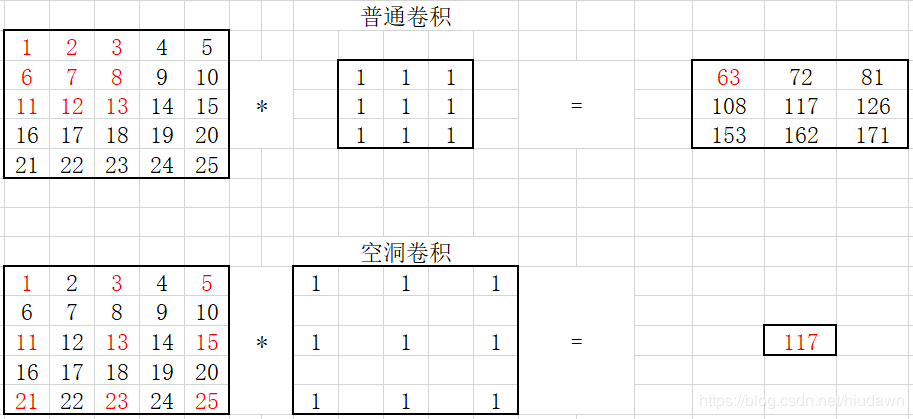

## nn.Conv2d
```python
nn.Conv2d(self, in_channels, out_channels, kernel_size, stride=1, padding=0, dilation=1, groups=1, bias=True))
    in_channels (int) – Number of channels in the input image
    out_channels (int) – Number of channels produced by the convolution
    kernel_size (int or tuple) – Size of the convolving kernel
    stride (int or tuple, optional) – Stride of the convolution. Default: 1
    padding (int or tuple, optional) – Zero-padding added to both sides of the input. Default: 0
    dilation (int or tuple, optional) – Spacing between kernel elements. Default: 1
    groups (int, optional) – Number of blocked connections from input channels to output channels. Default: 1
    bias (bool, optional) – If True, adds a learnable bias to the output. Default: True 
    
in_channel:　输入数据的通道数，例RGB图片通道数为3；
out_channel: 输出数据的通道数，这个根据模型调整；
kennel_size: 卷积核大小，可以是int，或tuple；kennel_size=2,意味着卷积大小2， kennel_size=（2,3），意味着卷积在第一维度大小为2，在第二维度大小为3；
stride：步长，默认为1，与kennel_size类似，stride=2,意味在所有维度步长为2， stride=（2,3），意味着在第一维度步长为2，意味着在第二维度步长为3；
padding：　填充
```
## dilation

```python
input =torch.randn([1, 1, 5, 5])#torch.Size([1, 1, 5, 5])
conv1 = nn.Conv2d(1, 1, 3, stride=1, bias=False, dilation=1, padding=0)  # 普通卷积
conv2 = nn.Conv2d(1, 1, 3, stride=1, bias=False, dilation=2, padding=0)  # dilation就是空洞率，即间隔
```



## torch.nn.functional.pad
torch是先填充再卷积。conv2d的策略如此。所以我先在forward中获取上述方程需要的参数。然后使用torch.nn.functional.pad填充就好了。
```python
t2=torch.randn([1,1,4,4])
print(t2.size())
m1 = torch.nn.Conv2d(1, 1, 1, padding=(1,0))
print(m1(t2).size()）
t2=F.pad(t2,(0,0,1,1))
print(t2.size())
pad是对称的两边都填充的，所以上述总共填充2行/列
参数中padding=(1,0)的效果，与F.pad(t2, (0,0,1,1)的效果一样。而不是与F.pad(t2,1,1,0,0)效果一样。很神奇。本来(1,0)按照解视是1是H边（左右）。0是W边（上下）。（0，0，1，1）按解释是左右不填充，上下填充。结果刚好相反。
```